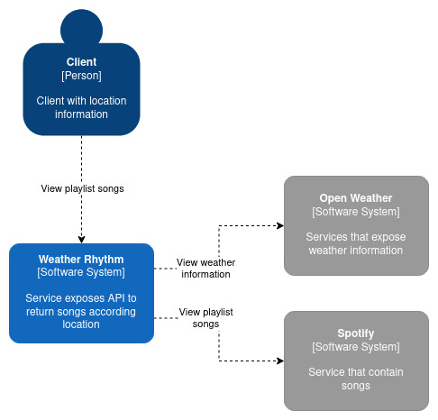
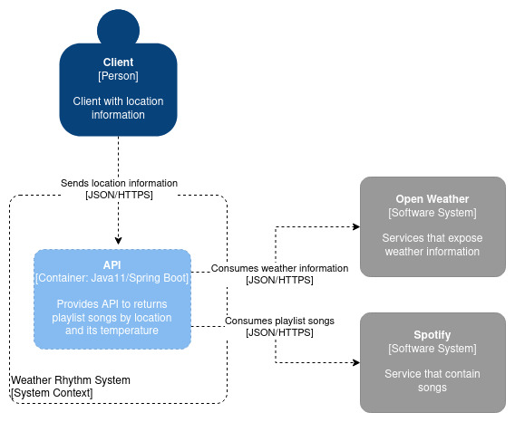

# Weather Rhythm API

The API Application provides playlist songs by the temperature of the places desired.

The rhythms will be chosen considering:

    1. If temperature (celcius) is above 30 degrees, suggest tracks for party;

    2. In case temperature is between 15 and 30 degrees, suggest pop music tracks;

    3. If it's a bit chilly (between 10 and 14 degrees), suggest rock music tracks;

    4. Otherwise, if it's freezing outside, suggests classical music tracks;

### Documentation
The C4 Model was used to documenting the API Application features and their interaction. 
The other C4 diagrams will be created(or changed) according to project advances.

#### System Context

#### Container

## Prerequisites to run locally
- [Gradle 4.0.1 or Later](https://gradle.org/install)

- [Java 11](https://openjdk.java.net/projects/jdk/11)

- [Enable the Lombok within the IDE](https://projectlombok.org)

## Built with
- [Clean Architecture](https://blog.cleancoder.com/uncle-bob/2012/08/13/the-clean-architecture.html)

- [C4 Model](https://c4model.com/)
  
- [Spring Boot 2.4.2-SNAPSHOT](https://spring.io/projects/spring-boot)

- [Spring Cloud OpenFeign](https://cloud.spring.io/spring-cloud-openfeign/reference/html/)

- [JUnit 5](https://junit.org/junit5/docs/current/user-guide/)

- [Mockito](https://site.mockito.org/)

- [Hamcrest](http://hamcrest.org/JavaHamcrest/)

- [Spring Doc](https://springdoc.org/)

## Access API Documentation
The API documentation may be accessed whether by SwaggerUI through the link `http://localhost:8080/swagger-ui.html` or
by Spring Doc `http://localhost:8080/v3/api-docs`.

